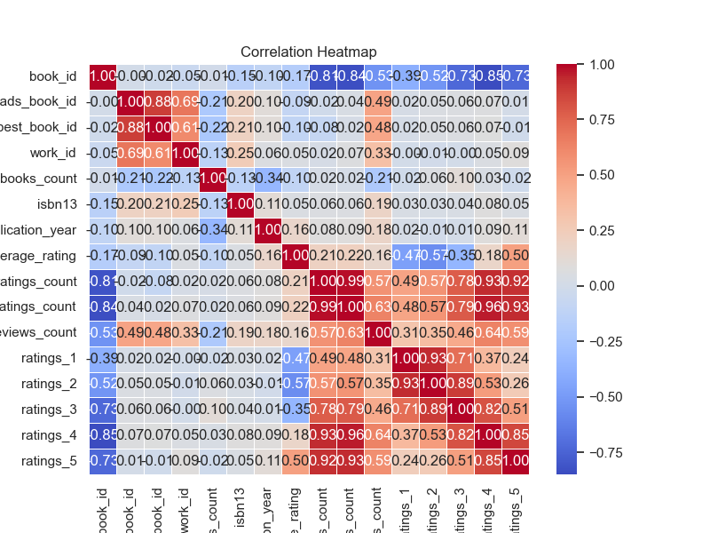
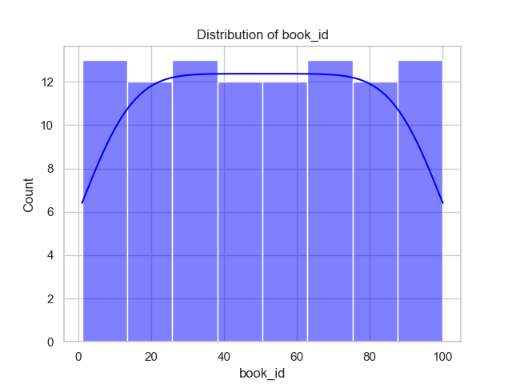
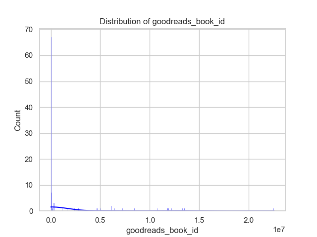
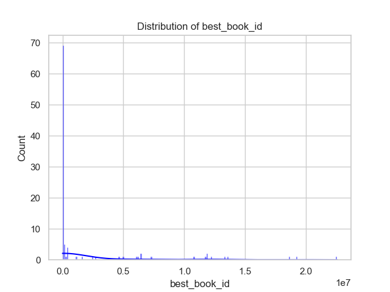

# Automated Data Analysis Report

This analysis will delve into the provided data summary, highlighting key characteristics of the dataset, statistical distributions, and correlations. Alongside this analysis, the referenced images will serve to visualize some of the discussed points.

### Summary of the Dataset

1. **Overview**:
   - The dataset contains 100 entries related to various book attributes, including IDs, authors, publication years, average ratings, and more. Each entry represents a unique book.

2. **Key Metrics**:
   - **Book IDs**: The IDs range from 1 to 100 with a mean of 50.5, demonstrating a uniform distribution across the range.
   - **Goodreads and Best Book IDs**: Average values show high variability (mean 1,637,511.61 for Goodreads Book ID and 2,000,050.25 for Best Book ID), suggesting that some books are ranked significantly higher than others on these platforms.
   - **Work IDs**: With a mean of 4,352,422.68 and a wide standard deviation of 6,443,136.80, this indicates considerable diversity in the dataset's entries.
   - **Books Count**: The average number of books per author is notable at 527.45, with a maximum of 3,455, suggesting some authors are highly prolific.
   - **Publication Year**: Books were originally published from as early as -720 (which seems incorrect) to 2015, with a mean publication year of approximately 1943.72, which largely represents modern literature.

### Ratings and Reviews

1. **Average Ratings**:
   - Average ratings range from **3.51 to 4.61**, reflecting generally favorable reviews of the books, with a mean of **4.0547**. The standard deviation (0.2438) suggests most ratings cluster closely around the mean.

2. **Distribution of Ratings**:
   - Data shows that ratings are heavily skewed towards the higher ends, particularly for 4 and 5 stars, with average counts of **417,978.91** (4 stars) and **600,102.76** (5 stars). This encourages a conclusion that the books present in this dataset are either critically acclaimed or targets a niche audience.

3. **Text Reviews**:
   - The dataset indicates a significant number of text reviews per book, with the mean for text reviews being **38,821.51**, and a maximum of **155,254**, suggesting strong engagement with these titles by readers.

### Author Distribution and Language

1. **Authors**:
   - There are **79 unique authors** in the dataset, the most frequent being **J.K. Rowling and Mary GrandPré**, indicating that certain authors have multiple works included.
   
2. **Language Code**:
   - Predominantly English books (eng, en-US), but with **99 entries in total**, we observe a diverse presence although the specific languages other than English are not listed.

### Correlation Analysis

1. **Correlation Findings**:
   - A notable negative correlation is present between the **ratings count** and **average ratings** (-0.8134), which implies that as the number of ratings increases, the average rating decreases slightly. This could suggest that popular books with many ratings receive more critical reviews as they are under higher scrutiny.
   - The **work ratings count** also exhibits a strong negative correlation with average ratings (-0.8360), reinforcing the trend observed with individual ratings.
   - Conversely, there exists a moderate positive correlation between **ratings count** and **work ratings count** (0.9852), indicating that books that receive more ratings also tend to be widely reviewed.

### Visualizations

1. **Distribution Visuals**:
   - The images of distributions (e.g., for `book_id`, `goodreads_book_id`, `best_book_id`) can provide clarity on how data is distributed across these metrics. This can be particularly instructive to observe how standardized these identifiers are over multiple dimensions.
   
   For example:
   - The `book_id_distribution.png` would illustrate how evenly the IDs are distributed from 1 to 100.
   - The `goodreads_book_id_distribution.png` and `best_book_id_distribution.png` would showcase the extreme variability and outliers seen in the corresponding data.

### Conclusion

This dataset provides a rich overview of books, their ratings, authors, and publication years, showcasing insights into reader engagement and author productivity. The statistical analysis reveals patterns that can inform future exploration or marketing strategies in the literary space. With the accompanying visualizations, the data can be further understood and leveraged for deeper analyses. 

Further investigations could focus on trends over specific time periods, correlations with sales data, or even content analysis based on reviews to ascertain what features contribute to a book's popularity.

