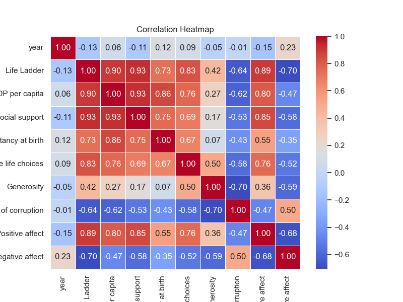
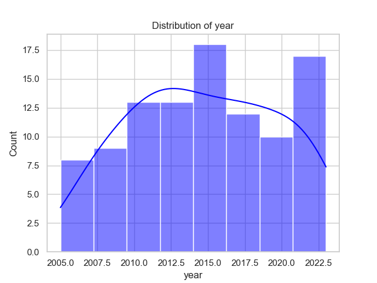
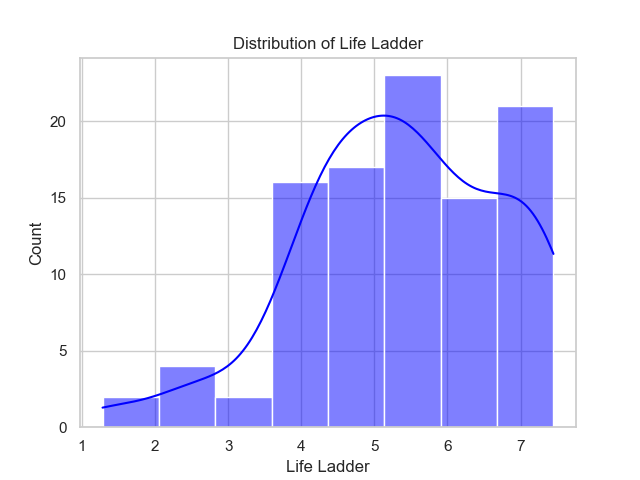
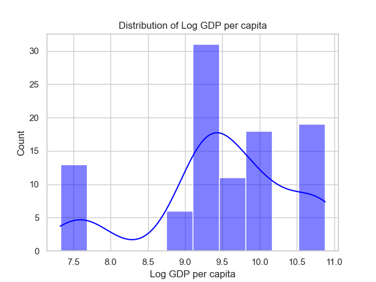

# Automated Data Analysis Report

Based on the provided data summary, let's delve into the key aspects, including distributions, correlations, and insights from the data.

### Overview of the Dataset

The dataset consists of 100 records, with key variables that include:

- **Country**: 8 unique countries, with Argentina being the most frequent (18 occurrences).
- **Year**: Ranging from 2005 to 2023, with an average of approximately 2014.72.
- **Well-being Metrics**: Variables such as Life Ladder, GDP per capita, social support, etc.

### Descriptive Statistics

1. **Year**:
   - The data covers years from 2005 to 2023.
   - The mean year is around 2014.72, suggesting that the dataset is somewhat skewed towards earlier years in the 2010s.
   - The standard deviation of approximately 4.97 indicates some variability in the years represented.

2. **Life Ladder**:
   - The mean score is 5.37 with a standard deviation of 1.39, indicating diverse perceptions of well-being.
   - The minimum score is 1.28 (potentially very low life satisfaction), while the maximum is 7.45, showing a range of significant disparity in life satisfaction across records.

3. **Log GDP per capita**:
   - The mean is approximately 9.51, with a standard deviation of 0.95.
   - This suggests a generally high GDP per capita, considering it is on a logarithmic scale.
   - The range (7.325 to 10.881) indicates variability in economic conditions across the countries.

4. **Social Support**:
   - A mean value of 0.77 with values ranging from 0.228 to 0.968 indicates a relatively high level of perceived social support.
   - The standard deviation of 0.16 shows some fluctuation in support levels.

5. **Healthy Life Expectancy at Birth**:
   - Mean expectancy is around 64.83 years, with a range of 50.5 to 71.2 years, indicating disparities in healthcare access and outcomes among countries.

6. **Freedom to Make Life Choices & Other Metrics**:
   - The average score for freedom to make life choices is about 0.68, reflecting moderate to high perceived autonomy.
   - Generosity has a mean slightly below zero, indicating a possible tendency towards lower altruistic behavior in the sample.

### Missing Values

Certain metrics reported missing values:
- Log GDP per capita (2 missing)
- Social support (1 missing)
- Freedom to make life choices (2 missing)
- Generosity (5 missing)
- Perceptions of corruption, Positive and Negative Affect (each with 1 or 2 missing)

This implies that while the dataset is largely complete, some key indicators may require imputation or analysis adjustments for these records to ensure robustness.

### Correlation Analysis

Correlation among the variables gives insights into the relationships:

- **Life Ladder vs. Log GDP per capita (0.90)**: A strong positive correlation suggests that as GDP per capita increases, so does the perceived life satisfaction.
- **Life Ladder and Social Support (0.93)**: Implies that higher social support is associated with increased life satisfaction.
- **Life Ladder and Positive Affect (0.89)**: Indicates that individuals who report higher life satisfaction also tend to report more positive emotions.
- **Negative Affect vs. Life Ladder (-0.70)**: This strong negative correlation indicates that higher life satisfaction corresponds with lower reported negative emotions.
- **Year Analysis**: The correlations with year are generally weak, showing little change in key metrics over time.

### Visual Insights

1. **Correlation Heatmap**: This visualization likely highlights the above correlations visually, emphasizing the relationships between well-being indicators.
2. **Year Distribution**: Provides an overview of how many records exist per year, critical to assessing the temporal coverage of the data.
3. **Life Ladder and Log GDP per capita Distributions**: These distributions can show the spread and central tendency of values, focusing on disparities and common scores within each metric.

### Conclusions

- **Argentina as Dominant Country**: With 18 occurrences, Argentina may be significantly influencing the overall metrics, especially regarding Life Ladder and related scores.
- **Disparities Exist**: The variations in life satisfaction and economic indicators suggest that policies aimed at improving economic conditions and social support could enhance overall well-being.
- **Potential Time Trends**: With a good spread of data over years, there may be opportunities to analyze trends in life satisfaction relative to economic or social changes.
- **Further Study**: Exploration of causative factors that result in higher life satisfaction—such as education, healthcare access, etc.—could yield actionable insights.

This analysis suggests a rich framework to understand well-being across different countries and highlights the importance of considering multiple metrics to obtain a holistic view of societal well-being.

