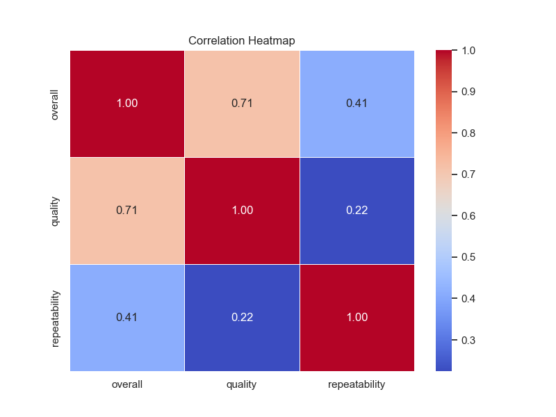
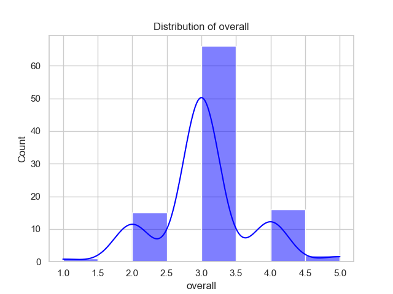
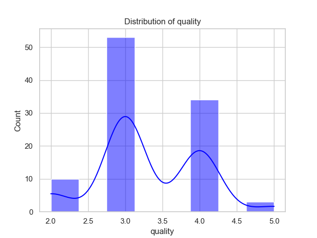
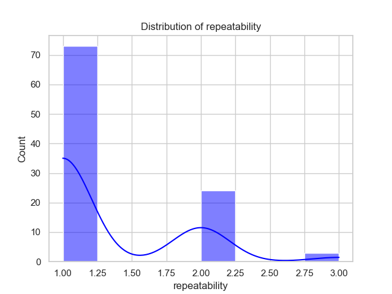

# Automated Data Analysis Report

Based on the provided data summary, we can extract several key insights about the dataset involving movie reviews or ratings. Here’s a detailed analysis:

### 1. Data Overview
- The dataset contains **100 entries**, which provide ratings and other information about movies.
- There are **87 unique dates**, which indicates diverse entries but also potential clustering of the entries around specific dates (the most frequent date is '15-Jul-23' appearing **3 times**).
- The entries are categorized into **8 languages**, with the most prevalent being **English** (**31 entries**).

### 2. Movie Type and Titles
- The dataset primarily consists of **3 movie types**, predominantly classified as **movies** (83 entries), showing a clear focus on film content.
- Among the **98 unique titles**, the title **'Jailer'** appears twice, suggesting it was significant enough to generate multiple entries, possibly due to sequels, remakes, or notable releases.

### 3. Contributors
- The **'by'** field identifies those involved in the movies, having **79 unique contributors** from **90 entries**. The most frequent entry here, **'Simon Baker, Robin Tunney'**, appears **6 times**, which implies collaboration or recurring themes involving these individuals.

### 4. Ratings Overview
- **Overall Ratings**:
  - The average overall rating is **3.03** with a standard deviation of **0.66**.
  - The ratings range from **1 to 5**, indicating a generally moderate reception, but also evidence of diversity in opinion, reflected in the spread.
  
- **Quality Ratings**:
  - The average quality rating is **3.3** with a standard deviation of **0.69**.
  - Quality ratings range from **2 to 5**, indicating that while most movies were rated sufficiently, there are cases of higher and lower assessments.
  
- **Repeatability Ratings**:
  - The average repeatability rating is **1.3**, showing significant entries rated as **1**, indicating that most respondents did not find the movies particularly rewatchable.
  - The repeatability scale ranges from **1 to 3**, with the majority rated either as not repeatable or very limited in rewatch value.

### 5. Missing Values
- There are **10 missing entries** for the **'by'** field, which could indicate that not all contributors are consistently recorded. All other fields show no missing values, suggesting a robust data collection process.

### 6. Correlation Analysis
- The correlation matrix shows potential interdependencies among overall ratings, quality, and repeatability:
  - The strongest correlation is between **overall** and **quality** ratings (**0.71**), indicating that higher quality films generally receive higher overall ratings.
  - There is a moderate correlation of **0.41** between **overall** and **repeatability**, suggesting that films rated higher overall are likely to have a somewhat better repeatability score as well.
  - The **quality** ratings and **repeatability** exhibit a weaker correlation (**0.22**), indicating that higher quality does not necessarily imply that a movie is more rewatchable.

### 7. Visual Representation
The analysis is complemented by the images provided, suggesting:
- **Correlation Heatmap**: This likely outlines the interrelationships between various metrics (useful for visualizing the strength of correlations).
- **Overall Distribution**: This may present how the overall ratings are spread, potentially supporting observations about the average rating and deviations.
- **Quality Distribution**: Expected to highlight the distribution of quality ratings, showing the frequency of various scores.
- **Repeatability Distribution**: This diagram could illustrate how often different repeatability scores were assigned, emphasizing the limited repeatability seen in the dataset.

### Conclusion
This dataset provides a multifaceted view of recent movie ratings with a strong emphasis on overall impressions, quality perceptions, and repeatability. The focus on movies in English with a robust set of contributors suggests an engaging array of content. Future analysis could look deeper into genre variations, the influence of specific contributors on ratings, or additional demographic data for richer insights.

